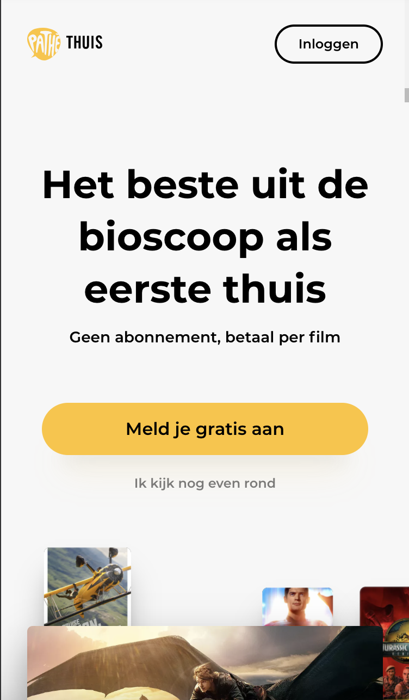
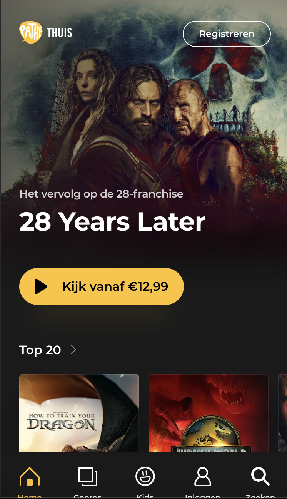

# Procesverslag
Markdown is een simpele manier om HTML te schrijven.  
Markdown cheat cheet: [Hulp bij het schrijven van Markdown](https://github.com/adam-p/markdown-here/wiki/Markdown-Cheatsheet).

Nb. De standaardstructuur en de spartaanse opmaak van de README.md zijn helemaal prima. Het gaat om de inhoud van je procesverslag. Besteedt de tijd voor pracht en praal aan je website.

Nb. Door *open* toe te voegen aan een *details* element kun je deze standaard open zetten. Fijn om dat steeds voor de relevante stuk(ken) te doen.

## Jij

  
uitwerken voor kick-off werkgroep

  ### Auteur:
  Vincent van Heukelom

  #### Je startniveau:
  Blauw

  #### Je focus:
  Responsive
 

## Je website

  
uitwerken voor kick-off werkgroep

  ### Je opdracht:
  https://www.pathe-thuis.nl/over-pathe-thuis

  #### Screenshot(s) van de eerste pagina (small screen): 
  Over Pathé Thuis 
  

  #### Screenshot(s) van de tweede pagina (small screen):
  Pathé Thuis Home 
  
 

## Toegankelijkheidstest 1/2 (week 1)

  
uitwerken na test in 2e werkgroep

  ### Bevindingen

1. Screenreaders werken niet altijd goed
Niet alle teksten, knoppen en koppen worden consistent en correct voorgelezen door screenreaders. Voor mensen die blind of slechtziend zijn, vormt dit een groot probleem. Als een screenreader bijvoorbeeld een knop niet als “klikbare knop” herkent, weet de gebruiker niet dat er actie mogelijk is. Ook kan het zijn dat de volgorde van informatie verkeerd wordt doorgegeven, waardoor de context verloren gaat en bezoekers moeite hebben om de pagina te begrijpen.
Voorbeeld: Een belangrijke melding of foutmelding die alleen visueel wordt weergegeven, wordt door een screenreader niet herkend, waardoor een gebruiker een cruciaal onderdeel van de site mist.

2. Navigeren met toetsenbord is moeilijk
Niet iedereen gebruikt een muis; sommige mensen navigeren uitsluitend met het toetsenbord, bijvoorbeeld via de Tab-toets. Op veel websites is de focusindicator (het blauwe randje of highlight dat laat zien welk element geselecteerd is) soms onzichtbaar of ontbreekt volledig. Daarnaast kan de tabvolgorde niet logisch zijn: een gebruiker kan dan van een kop direct naar een knop springen zonder eerst door de inhoud te gaan, of moet onnodig veel stappen nemen om bij belangrijke informatie te komen.
Gevolg: Mensen die blind, slechtziend of motorisch beperkt zijn, raken sneller de weg kwijt op de site en kunnen functionaliteiten niet goed gebruiken.

3. Tekst is soms slecht leesbaar
Goede leesbaarheid is cruciaal voor iedereen, maar vooral voor mensen met een visuele beperking. Op sommige delen van de website is het kleurcontrast tussen tekst en achtergrond te laag. Hierdoor wordt de tekst lastig te onderscheiden, vooral voor mensen met verminderd zicht of kleurenblindheid. Ook kan de tekstgrootte of het lettertype invloed hebben: te kleine letters of te dunne lijnen maken lezen moeilijker.
Voorbeeld: Lichtgrijze tekst op een witte achtergrond of gele tekst op een lichtgele achtergrond kan voor veel mensen praktisch onleesbaar zijn.

4. Afbeeldingen missen beschrijving
Veel afbeeldingen hebben geen alternatieve tekst (alt-tekst), waardoor screenreaders niet kunnen uitleggen wat er op de afbeelding staat. Voor mensen die blind zijn, betekent dit dat belangrijke visuele informatie verloren gaat. Ook zoekmachines gebruiken alt-teksten om afbeeldingen te begrijpen, dus ontbrekende beschrijvingen beïnvloeden zowel toegankelijkheid als SEO.
Voorbeeld: Een afbeelding van een product of een instructie zonder alt-tekst maakt het onmogelijk voor een screenreader-gebruiker om te begrijpen wat er getoond wordt, waardoor de informatie onvolledig is.

## Breakdownschets (week 1)

  
uitwerken na afloop 3e werkgroep

  ### de hele pagina: 
  
    

  ### dynamisch deel (bijv menu): 
  

  ### wellicht nog een dynamisch deel (bijv filter): 
  

## Voortgang 1 (week 2)

  
uitwerken voor 1e voortgang

  ### Stand van zaken
  Mijn code ziet er goed uit, ik moet vooral focussen op niet te veel classes gebruiken en veel nth of type's gaan gebruiken.

  ### Agenda voor meeting
  samen met je groepje opstellen

  | student 1      | student 2          | student 3    | student 4        |
  | ---            | ---                | ---          | ---              |
  | dit bespreken  | en dit             | en ik dit    | en dan ik dat    |
  | en dat ook nog | dit als er tijd is | nog een punt | dit wil ik zeker |
  | ...            | ...                | ...          | ...              |

  ### Verslag van meeting
  - Letten op overbodige classes
  - html ziet er goed uit
  - Goed begin gemaakt

## Voortgang 2 (week 3)

  
uitwerken voor 2e voortgang

  ### Stand van zaken
  Eerste gedeelte van de eerste website begint al erg te lijken op wat het moet zijn, ik moet toch gebruik maken van de afbeeldingen ipv screenshots.

  ### Agenda voor meeting
  samen met je groepje opstellen

  | student 1      | student 2          | student 3    | student 4        |
  | ---            | ---                | ---          | ---              |
  | dit bespreken  | en dit             | en ik dit    | en dan ik dat    |
  | en dat ook nog | dit als er tijd is | nog een punt | dit wil ik zeker |
  | ...            | ...                | ...          | ...              |

  ### Verslag van meeting
  hier na afloop snel de uitkomsten van de meeting vastleggen

  - Eerst alle html schrijven
  - Meer nth of type gebruiken ipv classes
  - Tweede pagina html alvast schrijven

## Toegankelijkheidstest 2/2 (week 4)

  
uitwerken na test in 9e werkgroep

  ### Bevindingen
  Bij de tweede pagina gaat het ook al erg goed. Ik heb de html meer systematisch gemaakt maar moet hier ook goed op blijven letten.

## Voortgang 3 (week 4)

  
uitwerken voor 3e voortgang

  ### Stand van zaken
  hier dit ging goed & dit was lastig (neem ook screenshots op van delen van je website en code)

  ### Agenda voor meeting
  samen met je groepje opstellen

  | student 1      | student 2          | student 3    | student 4        |
  | ---            | ---                | ---          | ---              |
  | dit bespreken  | en dit             | en ik dit    | en dan ik dat    |
  | en dat ook nog | dit als er tijd is | nog een punt | dit wil ik zeker |
  | ...            | ...                | ...          | ...              |

  ### Verslag van meeting
  hier na afloop snel de uitkomsten van de meeting vastleggen

  - Beter systematisch te werk gaan
  - Tweede pagina goed afmaken
  - Javascript toevoegen

## Eindgesprek (week 5)

  
uitwerken voor eindgesprek

  ### Je uitkomst - karakteristiek screenshots:
  

  ### Dit ging goed/Heb ik geleerd: 
  Tijdens dit project heb ik veel geleerd over het opzetten van een website en het structureren van code. Ik heb ontdekt hoe ik CSS efficiënt en overzichtelijk kan schrijven, waardoor het niet alleen makkelijker wordt om de stijl van een website aan te passen, maar ook om consistente ontwerpen te maken. Door CSS op een systematische manier te gebruiken, kan ik bijvoorbeeld herbruikbare klassen maken, kleuren en lettertypen centraal beheren met variabelen, en complexe lay-outs realiseren zonder dat de code onoverzichtelijk wordt.
  Daarnaast heb ik geleerd hoe ik HTML gestructureerd en logisch kan opbouwen, wat essentieel is voor zowel de leesbaarheid van de code als de toegankelijkheid van de website. Ik begrijp nu beter hoe ik elementen zoals koppen, paragrafen, lijsten, secties en artikelen op een duidelijke manier kan organiseren, zodat een gebruiker de inhoud gemakkelijk kan volgen en een screenreader de pagina correct kan interpreteren.
  Door deze systematische aanpak in zowel HTML als CSS kan ik websites ontwikkelen die niet alleen functioneel en mooi zijn, maar ook goed onderhouden kunnen worden. Het helpt me problemen sneller op te lossen, nieuwe onderdelen eenvoudiger toe te voegen en te zorgen dat de website consistent en professioneel oogt. Bovendien geeft het inzicht in hoe visuele styling en structuur samenwerken om een optimale gebruikerservaring te creëren.

  

  ### Dit was lastig/Is niet gelukt:
  Helaas is de pop-up op de website niet helemaal naar behoren afgerond. Hoewel ik de basisfunctionaliteit heb opgezet, werkte deze niet helemaal zoals ik had verwacht, waardoor hij niet volledig functioneel op de pagina verscheen. Daarnaast zijn de eerste en tweede footers mij ook niet volledig gelukt. De code hiervoor bleek complexer dan ik aanvankelijk had ingeschat, met name omdat het gebruik van flexbox, positionering en styling van meerdere elementen tegelijk veel aandacht en precisie vereist. Door tijdsgebrek was het helaas niet mogelijk om deze onderdelen helemaal af te maken of volledig te testen.
  Ik heb echter wel veel geleerd van het proces. Het werken aan de pop-up en de footers heeft mijn begrip van HTML-structuur, CSS-lay-outs en dynamische functionaliteit met JavaScript vergroot. Hoewel het eindresultaat nog niet volledig was, heeft het mij laten zien waar ik nog extra oefening in nodig heb en welke uitdagingen erbij komen kijken om een professionele, interactieve website te maken.

  

## Bronnenlijst

  
continu bijhouden terwijl je werkt

  Nb. Wees specifiek ('css-tricks' als bron is bijv. niet specifiek genoeg). 
  Nb. ChatGpT en andere AI horen er ook bij.
  Nb. Vermeld de bronnen ook in je code.

  1. CSS Tricks: A Complete Guide to Flexbox
  2. MDN Web Docs: border-radius
  3. MDN Web Docs: Using Media Queries
  4. DN Web Docs: ::before
  5. CSS Tricks: Scrolling and Overflow
  6. ChatGPT: Waarom gebruik je flex: 0 0 auto in een horizontale scroll-lijst?”
  7. ChatGPT: Hoe positioneer ik een element in het midden van de pagina met absolute positioning?
  8. ChatGPT: Wat is het verschil tussen position: relative en absolute en wanneer gebruik ik z-index?
  9. ChatGPT: Hoe gebruik ik ::before en ::after om een overlay of gradient te maken?
  10. ChatGPT: Wat is het verschil tussen een pseudo-element en een gewone div?
  11. ChatGPT: Hoe kan ik de grootte van afbeeldingen en tekst responsive maken?
  12. ChatGPT: Leg uit hoe box-shadow werkt en welke waardes ik kan aanpassen voor diepte-effect?
  13. ChatGPT: Hoe kan ik een subtiel schaduw-effect geven zonder dat het te opvallend is?
  14. ChatGPT: Hoe maak ik een horizontale scrollbare lijst met CSS?
  15. ChatGPT: Hoe maak ik een gradient overlay over een afbeelding?
  16. ChatGPT: Hoe kan ik een element laten verschijnen als je naar beneden scrollt?
  17. ChatGPT: Hoe maak ik een fixed element dat boven andere content blijft staan?

